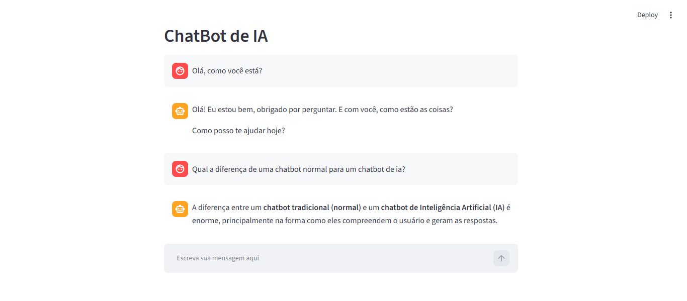
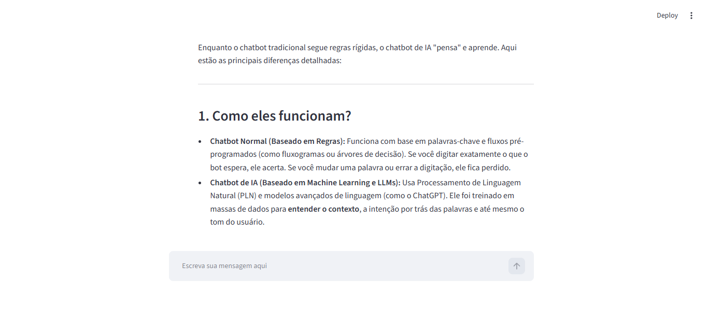

# 📊 ChatBot de IA com Python e Gemini

> Chatbot desenvolvido com Python, Streamlit e Google Gemini API, permitindo a insteração com uma IA por meio de uma interface web.

## 📌 Sobre o Projeto

Este projeto foi desenvolvido com o objetivo de desenvolver uma Chatbot de IA capaz de receber perguntas do usuário e gerar respostas inteligentes e dinâmicas em tempo real.

A proposta é aplicar conhecimentos de Python, integração com APIs e desenvolvimento de interfaces interativas, explorando na prática o funcionamento de um sistema de conversação com Inteligência Artificial.

O projeto faz parte do Jornada Python, da Hashtag Treinamentos, com foco no desenvolvimento de aplicações práticas e na utilização de Pythone em projetos reais.

## ⚙️ Funcionalidades

- Interface interativa para conversação com a IA.
- Envio de mensagens por meio de um campo de entrada
- Geração de respostar iteligentes utilizando o Google Gemini
- Exibição do histórico de mensagens durante a sessão
- Manutenção do contexto da conversa para permitir interações contínuas

## 🛠️ Tecnologias Utilizadas

As seguintes tecnologias e ferramentas foram utilizadas no desenvolvimento:

- **Python:** linguagem de programação utilizada no desenvolvimento da aplicação.
- **Streamlit:** criação da interface interativa do chatbot.
- **Google Gemini API:** geração de respostas utilizando IA.
- **OpenAI Python:** comunicação com a API do Gemini por meio de um endpoint compatível com a OpenAI.
- **Python-dotenv:** gerenciamento de variáveis de ambiente para proteger a chave da API.

## 🔐 Segurança

A chave de API do Gemini é armazenada em uma variável de ambiente, utilizando o python-dotenv, evitando sua exposição direta no código-fonte.

O arquivo .env está incluído no .gitignore para evitar o envio acidental ao GitHub. O arquivo .env.example disponibiliza apenas um modelo de configuração, sem informações confidenciais.

Ao baixar e tentar executar o código no seu computador, crie um arquivo chamado .env na raiz do projeto, utilizando o .env.example como modelo.

Adiciona sua chave de API:
```
GEMINI_API_KEY = sua_chave_aqui
```

Substitua sua_chave_aqui pela sua chave de API do Google AI Studio, mantendo-a em segurança e sem compartilhá-la publicamente.

## 🖥️ Demonstração

A aplicação apresenta uma interface simples e interativa que permite ao usuário enviar perguntas e receber respostas de uma Inteligência Artificial.





## 📚 Aprendizados

Durante o desenvolvimento deste projeto, foram praticados os seguintes conceitos:

- Desenvolvimento de aplicações com Python
- Criação de interfaces utilizando o streamlit.
- Integração com APIs de Inteligência Artificial.
- Gerencimento de histórico de conversas.
- Utilizaçao de variáveis de ambiente para proteger informações sensíveis.

---

## 👩‍💻 Autoria

- **Eliana Silva Nascimento**

- [GitHub](https://github.com/ElianaNascimento061)
- [LinkedIn](https://www.linkedin.com/in/eliana-da-silva-nascimento-728121250/)

---
