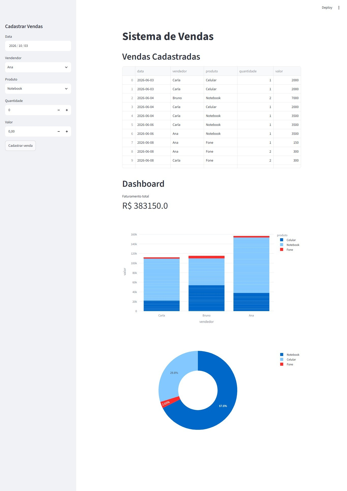

# 📊 Sistema de Cadastro de Vendas

> Sistema interativo de cadastro e gerenciamento de vendas desenvolvido com Python, Streamlit, Pandas e Plotly, permitindo registrar vendas e consultar informações

## 📌 Sobre o Projeto

Este projeto foi desenvolvido com o objetivo de criar um sistema online de cadastro e acompanhamento de vendas, permitindo registrar informações como data, vendedor, produto, quantidade e valor da venda, além de visualizar os dados de forma organizada e interativa.

A aplicação conta com uma interface intuitiva, que possibilita o cadastro de novas vendas, a consulta dos registros realizados e a análise dos resultados por meio de indicadores e gráficos.

O projeto faz parte do Jornada Python, da Hashtag Treinamentos, com foco na aplicação prática de Python para automação de tarefas, manipulação de dados e desenvolvimento de sistemas.

## ⚙️ Funcionalidades

- Cadastro de Vendas: formulário para registrar data, vendedor, produto, quantidade e valor.
- Validação de Dados: verificação dos campos de cadastro, incluindo quantidade e valor, para evitar registros inválidos.
- Vendas Cadastradas: armazenamento e consulta dos registros em uma tabela.
- Dashboard Interativo: apresentação de indicadores e gráficos para acompanhamento dos resultados.
- Faturamento Total: exibição do valor total das vendas registradas.
- Vendas por Vendedor: gráfico de barras para visualizar o desempenho de vendas por vendedor.
- Vendas por Produto: gráfico de pizza para visualizar a distribuição das vendas por produto.
- Atualização dos Dados: inclusão de novos registros no arquivo CSV, mantendo a base de vendas atualizada.

## 🛠️ Tecnologias Utilizadas

* Python: linguagem utilizada no desenvolvimento da aplicação.
* Streamlit: criação da interface web interativa e dos formulários de cadastro.
* Pandas: manipulação, organização e atualização dos dados de vendas.
* Plotly Express: criação de gráficos interativos para visualização dos indicadores.
* CSV: armazenamento dos registros de vendas.

## 📊 Dashboard

O sistema apresenta um painel de acompanhamento com indicadores e visualizações gráficas que facilitam a análise dos dados.

- Faturamento total: apresenta a soma dos valores das vendas cadastradas.
- Vendas por vendedor: permite comparar os valores de vendas registrados por cada vendedor.
- Vendas por produto: apresenta a distribuição das vendas entre os produtos cadastrados.

## 📚 Aprendizados

Durante o desenvolvimento deste projeto, foram aplicados os seguintes conceitos:

* Desenvolvimento de aplicações web com Python e Streamlit.
* Criação de formulários e componentes interativos.
* Manipulação e atualização de arquivos CSV com Pandas.
* Validação e organização de dados.
* Criação de indicadores e métricas de desempenho.
* Visualização de dados por meio de gráficos interativos com Plotly.
* Desenvolvimento de dashboards para análise de informações.

---

## 👩‍💻 Autoria

- **Eliana Silva Nascimento**

- [GitHub](https://github.com/ElianaNascimento061)
- [LinkedIn](https://www.linkedin.com/in/eliana-da-silva-nascimento-728121250/)

---
